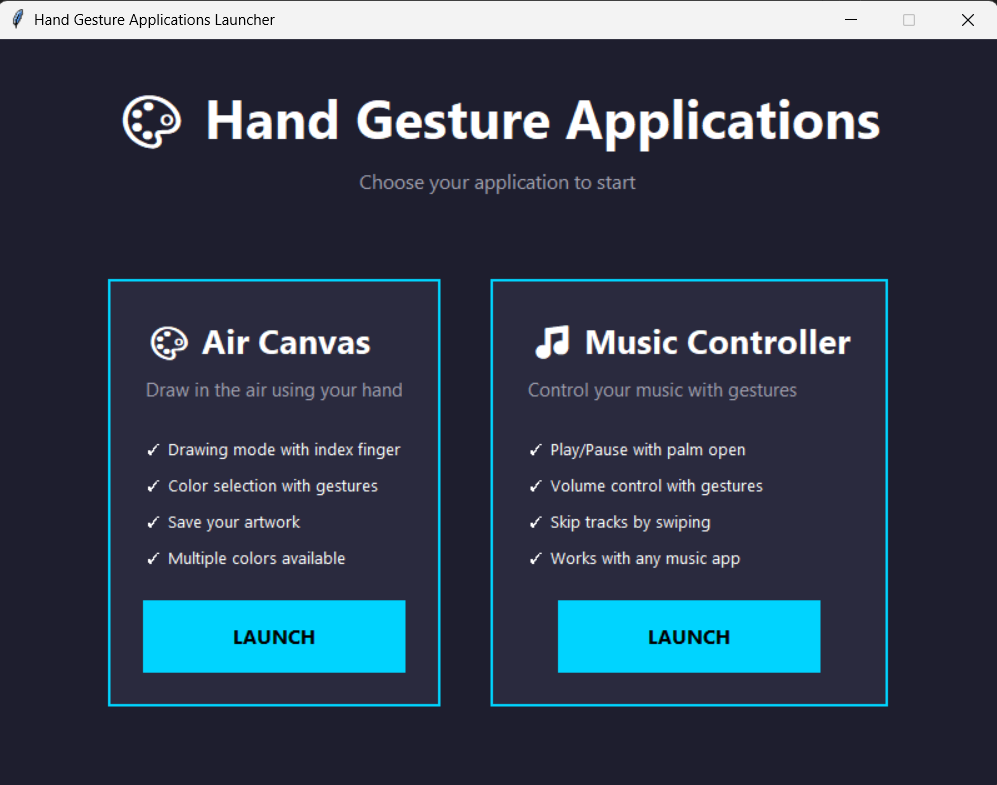
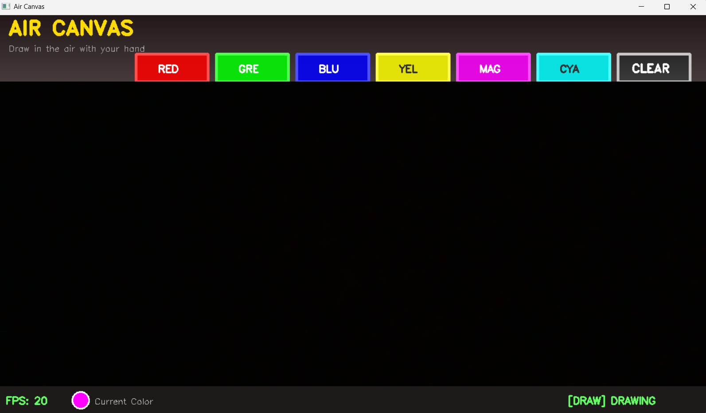
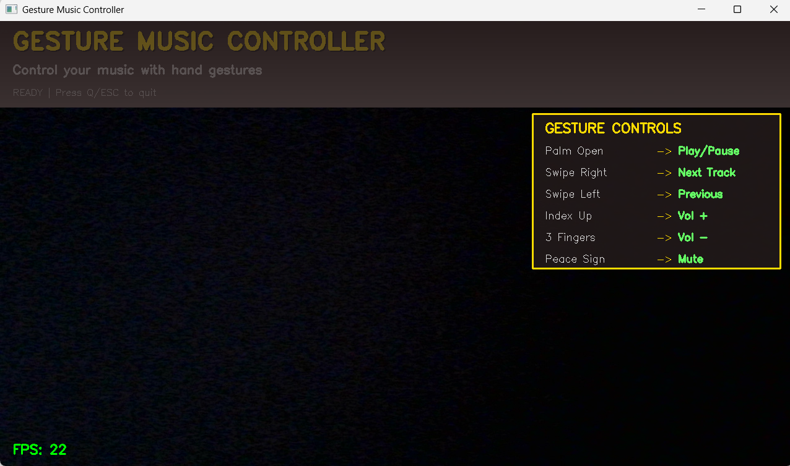

# 🎨 Hand Gesture Applications

**A collection of interactive hand gesture-controlled applications using Computer Vision**

Control your computer and create art using just your hands and webcam! This project includes two powerful applications:
1. **Air Canvas** - Draw in the air with your fingers
2. **Gesture Music Controller** - Control your music playback with hand gestures

---

## � Screenshots

### Modern Launcher

### Air Canvas - Draw in the Air

### Gesture Music Controller

---

## ✨ Features

### 🎨 Air Canvas
- ✏️ **Drawing Mode** - Draw using your index finger
- 🖱️ **Selection Mode** - Select colors with two fingers
- 🎨 **6 Colors** - Red, Green, Blue, Yellow, Magenta, Cyan
- 🧹 **Clear Canvas** - One-click to clear
- 💾 **Save Drawing** - Save as PNG image
- 📊 **Modern UI** - Professional gradient interface

### 🎵 Gesture Music Controller
- ⏯️ **Play/Pause** - Open palm gesture
- ⏭️ **Next Track** - Swipe right
- ⏮️ **Previous Track** - Swipe left
- 🔊 **Volume Up** - Index finger up
- 🔉 **Volume Down** - Three fingers up
- 🔇 **Mute/Unmute** - Peace sign
- 🎮 **Universal** - Works with Spotify, YouTube, any music app
- 🎨 **Modern UI** - Glass-morphism design with real-time feedback

---

## 📋 Requirements

- **Python 3.12** (or 3.11, 3.10)
- **Webcam**
- **Windows** (tested on Windows, but should work on macOS/Linux)

**Required packages:**
- opencv-python
- mediapipe
- numpy
- pyautogui
- pycaw
- comtypes
- psutil

---

## 🎮 How to Use

### Air Canvas

**Controls:**
| Gesture | Action |
|---------|--------|
| ☝️ Index finger only | Draw on canvas |
| ✌️ Index + Middle fingers | Selection mode (choose colors) |
| Press **'s'** | Save drawing |
| Press **'q'** or **ESC** | Quit |
| Click **X** button | Close window |

**Tips:**
- Keep your hand visible in the camera
- Use good lighting
- Point directly with your index finger to draw
- Raise two fingers to select colors from the top bar

### Gesture Music Controller

**Controls:**
| Gesture | Action |
|---------|--------|
| ✋ Palm Open | Play/Pause |
| 👉 Swipe Right | Next Track |
| 👈 Swipe Left | Previous Track |
| ☝️ Index Finger Up | Volume Up |
| 🖖 3 Fingers Up | Volume Down |
| ✌️ Peace Sign | Mute/Unmute |

**Tips:**
- Start playing music first
- Make clear, distinct gestures
- Wait a moment between gestures (cooldown prevention)
- Gestures are displayed on screen when detected
---

## 🎯 How It Works

### Technology Stack
- **OpenCV** - Image processing and display
- **Mediapipe** - Hand tracking (21 landmark points)
- **NumPy** - Efficient array operations
- **PyAutoGUI** - Keyboard simulation for media controls
- **Pycaw** - Windows audio control

### Hand Detection
1. Mediapipe detects 21 hand landmarks in real-time
2. Identifies which fingers are up/down
3. Tracks finger positions and movements

### Gesture Recognition
- **Palm Open**: All 5 fingers extended
- **Peace Sign**: Only index and middle fingers up
- **Swipe**: Hand movement > 150 pixels horizontally
- **3 Fingers**: Index, middle, and ring fingers up

---
## 📝 License

This project is licensed under the MIT License.

---

## 🎓 Learning Resources

- [OpenCV Documentation](https://docs.opencv.org/)
- [Mediapipe Hand Tracking](https://google.github.io/mediapipe/solutions/hands.html)
- [Python Official Docs](https://docs.python.org/3/)

---

## 🔮 Future Enhancements

- [ ] Support for multiple hands
- [ ] Custom gesture recording
- [ ] More drawing tools (shapes, brushes)
- [ ] Gesture macros and shortcuts
- [ ] Cross-platform volume control
- [ ] Mobile app version
- [ ] Voice command integration

---

